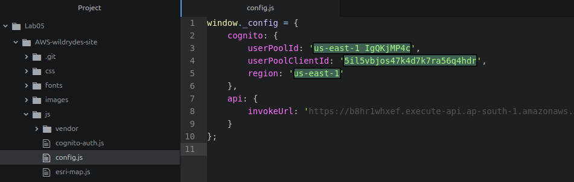
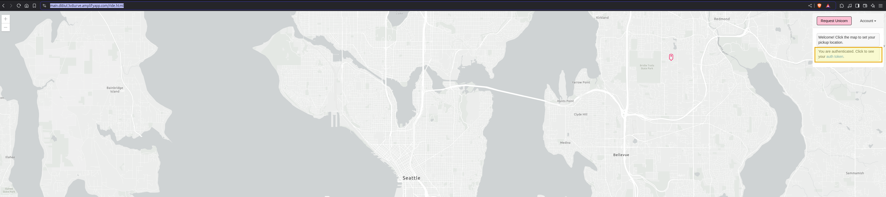

# AYGO-Lab-Information-Security

## Summary

This lab is based on the [AWS Wild Rydes Serverless Workshop](https://aws.amazon.com/en/getting-started/hands-on/build-serverless-web-app-lambda-apigateway-s3-dynamodb-cognito/) with some differences in implementation due to outdated instructions. The original workshop guides you through building a serverless web application where users can request unicorn rides, demonstrating fundamental concepts of cloud computing and serverless architecture.

## Project Description

Wild Rydes is a unique ride-sharing application that connects users with unicorns for their transportation needs.

### Architecture Overview

#### Frontend Layer (AWS Amplify)
The application's user interface is hosted through AWS Amplify, providing:

- Static web hosting with global content delivery
- Continuous deployment from your git repository
- Automatic SSL certificate management
- Built-in CI/CD pipeline

#### Authentication Layer (Amazon Cognito)
User management and authentication are handled by Amazon Cognito, offering:

- Secure user registration and sign-in flows
- Token-based authentication
- Integration with API Gateway for securing backend resources
- Session management and token refresh mechanisms

#### API Layer (Amazon API Gateway)
The API Gateway serves as the application's communication hub:

- RESTful API endpoints for frontend-backend communication
- Request validation and transformation
- API key management and usage plans
- CORS support for web security

#### Business Logic Layer (AWS Lambda)
AWS Lambda functions implement the core business logic:

- Processing ride requests
- Matching users with nearby unicorns
- Managing ride status and updates
- Handling database operations

#### Data Persistence Layer (Amazon DynamoDB)
DynamoDB provides a scalable, high-performance database solution:

- NoSQL data storage for ride information
- Automatic scaling based on demand
- Consistent performance at any scale
- Backup and recovery capabilities

## Prerequisites

* Have an AWS account
* Have aws-cli and aws-cdk installed locally

**Notes:**

1. This lab used an AWS Academy account; IAM roles have limited privileges for this account type.

### AWS-CLI Setup

- Find your AWS credentials:


* aws_access_key_id
* aws_secret_access_key
* aws_session_token

  

* Region name: us-east-1 (in this case)


1. Confugure your AWS CLI credentials:

> - If this is not the first time you are doing this configuration, simply edit the *~/.aws/credentials* file, copying and pasting the values ​​for: *aws_access_key_id*, *aws_secret_access_key*, *aws_session_token*, into it:

```
nano ~/.aws/credentials
```
  

> - If this is your first time, run:

```
aws configure
```


>> Now edit the *~/.aws/credentials* file and add the value for the *aws_session_token* variable.

> - You can verify that it was configured correctly if when running any aws-cli command it does not give you an error, in this case the existing instances are checked

```
aws ec2 describe-instances
```


## Prerequisites


## Hands-on: Building a Serverless Web App with Lambda, Apigateway, S3, DynamoDB and Cognito

### 1. Hosting a static website

1. Create a Github repository (including the README.md); in this case is [AWS-wildrydes-site](https://github.com/nduran06/AWS-wildrydes-site)

2. Launch the [AWS Amplify console](https://console.aws.amazon.com/amplify/home) and click on ***Deploy and app***

  

3. On the Start building with Amplify page, choose ***Github*** as the source code provider

  

4. Update your GitHub permissions

* *Two-factor authentication (2FA) authentication*

  

* The previously created repository is selected for use in AWS Amplify

  
  


5. Select the repository and the branch (*main* in thi case) in AWS Amplify; click on next


6. On the App settings, leave all the default values and click next

7. Your config should look like this:


* Select *Save and Deploy.*


8. When the resource is created, you will see the link to launch the site:


* At this point, if you click on the link provided (in this case *https://main.di8iut3v8urve.amplifyapp.com/*), since it is an empty repository, you should see something like:


9. Go to *App settings* and click on the *Edit* option

  

10. Enable *Branch autodetection* and *Branch auto-disconnection*, then save it:

  

### Populate the git repository

Originally for this workshop, this repository: [aws-samples/
aws-serverless-webapp-workshop](https://github.com/aws-samples/aws-serverless-webapp-workshop) was the one used to populate our repositories; however since it has been archived, a setup mirror was done in this implementation:

1. The previously created repository is cloned locally, and move to it:

```
git clone https://github.com/nduran06/AWS-wildrydes-site.git && cd AWS-wildrydes-site
```
2. Create a bare copy of the *aws-samples/aws-serverless-webapp-workshop* repository (only Git's internal data structures, no source files to edit):

```
git clone --bare https://github.com/aws-samples/aws-serverless-webapp-workshop.git
```

3. Push exact copy (mirror) to the new repository (*AWS-wildrydes-site*)

```
cd aws-serverless-webapp-workshop.git && git push --mirror https://github.com/nduran06/AWS-wildrydes-site.git
```

4. Go up one directory; remove the bare repo directory; update the local repo with remote changes, replaying the local commits on top of the updated remote history:

```
cd .. && rm -rf aws-serverless-webapp-workshop.git && git pull --rebase
```
* This method was used to copy/clone the entire repository, including all branches and history, to the new location while maintaining the full Git history.


* Now, when you click on the link provided (in this case *https://main.di8iut3v8urve.amplifyapp.com/*), you should be able to see the website:

  


### 2. Manage users

1. Launch the [AWS Console console](https://console.aws.amazon.com/cognito/home) and select the ***Add sign-in and sign-up experiences to your app*** option:


2. Set up your application:

> **1. Define your application**

* **Application type:** Single-page application (SPA)
* **Name your application:** (*Give your app a name*) WildRydesWebApp

> **2. Configure options**

* **Options for sign-in identifiers:** Email, Username
* **Required attributes for sign-up:** Email


>> After creation, you will see the name of the identity pool for your Cognito component, where you can find the users who are registered and can access your application. In this case the name is ***User pool - n6gjqz***.

  

> In the **View quick setup guide** section, find the `cognitoAuthConfig` variable, and save the values ​​for: *region*, *userPoolId*, and *userPoolClientId*:

In `cognitoAuthConfig` you will find the attributes `authority` and `client_id`, with this structure:

* `authority:` `https://cognito-idp-`***region***`-amazonaws.com/`***userPoolId***
* `client_id:` ***userPoolClientId***

  

3. Go to the [AWS-wildrydes-site configuration file (js/config.js)](https://github.com/nduran06/AWS-wildrydes-site/blob/main/js/config.js) and assign the above values ​​to the corresponding variables:



4. Commit the changes and push it to the repository:

```
git commit -m "cognito config"
```
```
git push
```


5. Go to the [wildrydes app](https://main.di8iut3v8urve.amplifyapp.com/), scroll down and click on **GIDDY UP!**:

  

> You will be redirected to the registration page:


6. Register yourself in the app:


7. Check your email and enter the confirmation code:

  

> You will see a success/error message:


8. Access the app with your registered credentials:


> You will be see the ride page; the right side you will see a message that says: *You are authenticated. Click to see your <ins>**auth token**</ins>:*



9. Click on <ins>**auth token**</ins> and save it as it will be used later:


## 3. Serverless service backend

  
  
  
  
  
  
  
  
  
  
  


## 4. Deploy an API RESTful

  
  
  
  
  
  
  
  
  
  
  
  
  
  
  


## Test

1. Select a point in the map and click on **Request Unicorn**:


> You will see a Unicorn flying to your point *(this request is saved in the DynamoDB-Rides table)*:


[](https://pruebacorreoescuelaingeduco-my.sharepoint.com/:v:/g/personal/natalia_duran-v_mail_escuelaing_edu_co/ESaI-zr6-lNFumF4IsNUwhgB4YUFFh9AmmrY4F5BizoZ-Q?nav=eyJyZWZlcnJhbEluZm8iOnsicmVmZXJyYWxBcHAiOiJPbmVEcml2ZUZvckJ1c2luZXNzIiwicmVmZXJyYWxBcHBQbGF0Zm9ybSI6IldlYiIsInJlZmVycmFsTW9kZSI6InZpZXciLCJyZWZlcnJhbFZpZXciOiJNeUZpbGVzTGlua0NvcHkifX0&e=iXu5aU)
