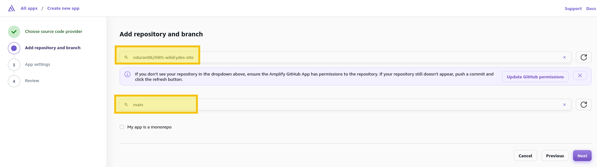
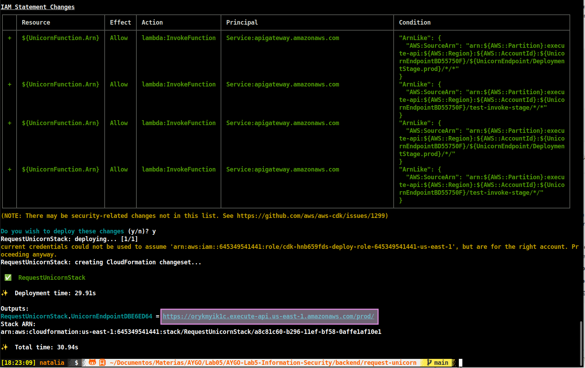
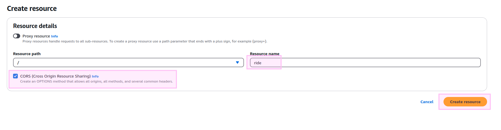

# AYGO-Lab-Information-Security

## Summary

This lab is based on the [AWS Wild Rydes Serverless Workshop](https://aws.amazon.com/en/getting-started/hands-on/build-serverless-web-app-lambda-apigateway-s3-dynamodb-cognito/) with some differences in implementation due to outdated instructions. The original workshop guides you through building a serverless web application where users can request unicorn rides, demonstrating fundamental concepts of cloud computing and serverless architecture.

> **Test Video**

[](https://pruebacorreoescuelaingeduco-my.sharepoint.com/:v:/g/personal/natalia_duran-v_mail_escuelaing_edu_co/ESaI-zr6-lNFumF4IsNUwhgB4YUFFh9AmmrY4F5BizoZ-Q?nav=eyJyZWZlcnJhbEluZm8iOnsicmVmZXJyYWxBcHAiOiJPbmVEcml2ZUZvckJ1c2luZXNzIiwicmVmZXJyYWxBcHBQbGF0Zm9ybSI6IldlYiIsInJlZmVycmFsTW9kZSI6InZpZXciLCJyZWZlcnJhbFZpZXciOiJNeUZpbGVzTGlua0NvcHkifX0&e=iXu5aU)

## Project Description

Wild Rydes is a unique ride-sharing application that connects users with unicorns for their transportation needs.

### Architecture Overview

#### Frontend Layer (AWS Amplify)
The application's user interface is hosted through AWS Amplify, providing:

- Static web hosting with global content delivery
- Continuous deployment from your git repository
- Automatic SSL certificate management
- Built-in CI/CD pipeline

#### Authentication Layer (Amazon Cognito)
User management and authentication are handled by Amazon Cognito, offering:

- Secure user registration and sign-in flows
- Token-based authentication
- Integration with API Gateway for securing backend resources
- Session management and token refresh mechanisms

#### API Layer (Amazon API Gateway)
The API Gateway serves as the application's communication hub:

- RESTful API endpoints for frontend-backend communication
- Request validation and transformation
- API key management and usage plans
- CORS support for web security

#### Business Logic Layer (AWS Lambda)
AWS Lambda functions implement the core business logic:

- Processing ride requests
- Matching users with nearby unicorns
- Managing ride status and updates
- Handling database operations

#### Data Persistence Layer (Amazon DynamoDB)
DynamoDB provides a scalable, high-performance database solution:

- NoSQL data storage for ride information
- Automatic scaling based on demand
- Consistent performance at any scale
- Backup and recovery capabilities

## Prerequisites

* Have an AWS account
* Have aws-cli and aws-cdk installed locally

**Notes:**

1. This lab used an AWS Academy account; IAM roles have limited privileges for this account type.

### AWS-CLI Setup

- Find your AWS credentials:


* aws_access_key_id
* aws_secret_access_key
* aws_session_token

  

* Region name: us-east-1 (in this case)


1. Confugure your AWS CLI credentials:

> - If this is not the first time you are doing this configuration, simply edit the *~/.aws/credentials* file, copying and pasting the values ​​for: *aws_access_key_id*, *aws_secret_access_key*, *aws_session_token*, into it:

```
nano ~/.aws/credentials
```
  

> - If this is your first time, run:

```
aws configure
```


>> Now edit the *~/.aws/credentials* file and add the value for the *aws_session_token* variable.

> - You can verify that it was configured correctly if when running any aws-cli command it does not give you an error, in this case the existing instances are checked

```
aws ec2 describe-instances
```


## Prerequisites


## Hands-on: Building a Serverless Web App with Lambda, Apigateway, S3, DynamoDB and Cognito

### 1. Hosting a static website

1. Create a Github repository (including the README.md); in this case is [AWS-wildrydes-site](https://github.com/nduran06/AWS-wildrydes-site)

2. Launch the [AWS Amplify console](https://console.aws.amazon.com/amplify/home) and click on ***Deploy and app***

  

3. On the Start building with Amplify page, choose ***Github*** as the source code provider

  

4. Update your GitHub permissions

* *Two-factor authentication (2FA) authentication*

  

* The previously created repository is selected for use in AWS Amplify

  
  


5. Select the repository and the branch (*main* in thi case) in AWS Amplify; click on next



6. On the App settings, leave all the default values and click next

7. Your config should look like this:


* Select *Save and Deploy.*


8. When the resource is created, you will see the link to launch the site:


* At this point, if you click on the link provided (in this case *https://main.di8iut3v8urve.amplifyapp.com/*), since it is an empty repository, you should see something like:


9. Go to *App settings* and click on the *Edit* option

  

10. Enable *Branch autodetection* and *Branch auto-disconnection*, then save it:

  

### Populate the git repository

Originally for this workshop, this repository: [aws-samples/
aws-serverless-webapp-workshop](https://github.com/aws-samples/aws-serverless-webapp-workshop) was the one used to populate our repositories; however since it has been archived, a setup mirror was done in this implementation:

1. The previously created repository is cloned locally, and move to it:

```
git clone https://github.com/nduran06/AWS-wildrydes-site.git && cd AWS-wildrydes-site
```
2. Create a bare copy of the *aws-samples/aws-serverless-webapp-workshop* repository (only Git's internal data structures, no source files to edit):

```
git clone --bare https://github.com/aws-samples/aws-serverless-webapp-workshop.git
```

3. Push exact copy (mirror) to the new repository (*AWS-wildrydes-site*)

```
cd aws-serverless-webapp-workshop.git && git push --mirror https://github.com/nduran06/AWS-wildrydes-site.git
```

4. Go up one directory; remove the bare repo directory; update the local repo with remote changes, replaying the local commits on top of the updated remote history:

```
cd .. && rm -rf aws-serverless-webapp-workshop.git && git pull --rebase
```
* This method was used to copy/clone the entire repository, including all branches and history, to the new location while maintaining the full Git history.


* Now, when you click on the link provided (in this case *https://main.di8iut3v8urve.amplifyapp.com/*), you should be able to see the website:

  


### 2. Manage users

1. Launch the [AWS Console console](https://console.aws.amazon.com/cognito/home) and select the ***Add sign-in and sign-up experiences to your app*** option:


2. Set up your application:

> **1. Define your application**

* **Application type:** Single-page application (SPA)
* **Name your application:** (*Give your app a name*) WildRydesWebApp

> **2. Configure options**

* **Options for sign-in identifiers:** Email, Username
* **Required attributes for sign-up:** Email


>> After creation, you will see the name of the identity pool for your Cognito component, where you can find the users who are registered and can access your application. In this case the name is ***User pool - n6gjqz***.

  

> In the **View quick setup guide** section, find the `cognitoAuthConfig` variable, and save the values ​​for: *region*, *userPoolId*, and *userPoolClientId*:

In `cognitoAuthConfig` you will find the attributes `authority` and `client_id`, with this structure:

* `authority:` `https://cognito-idp-`***region***`-amazonaws.com/`***userPoolId***
* `client_id:` ***userPoolClientId***

  

3. Go to the [AWS-wildrydes-site configuration file (js/config.js)](https://github.com/nduran06/AWS-wildrydes-site/blob/main/js/config.js) and assign the above values ​​to the corresponding variables:


4. Commit the changes and push it to the repository:

```
git commit -m "cognito config"
```
```
git push
```


5. Go to the [wildrydes app](https://main.di8iut3v8urve.amplifyapp.com/), scroll down and click on **GIDDY UP!**:

  

> You will be redirected to the registration page:


6. Register yourself in the app:


7. Check your email and enter the confirmation code:

  

> You will see a success/error message:


8. Access the app with your registered credentials:


> You will be see the ride page; the right side you will see a message that says: *You are authenticated. Click to see your <ins>**auth token**</ins>:*


9. Click on <ins>**auth token**</ins> and save it as it will be used later:


### 3. Serverless service backend

1. Create a new folder that will be used to create your cdk application:

```
mkdir request-unicorn && cd request-unicorn
```


2. Initialize the cdk application with javascript as the selected language:

```
cdk init app --language javascript
```

  

> ***Observation:** If you see a warning because the version of **Node.js** is higher than the maximum tested version for **cdk**, run the following command to avoid it:*

```
export JSII_SILENCE_WARNING_UNTESTED_NODE_VERSION=1
```

3. Prepare your AWS environment to use cdk; save the default template used by the CDK bootstrap process to a yaml file (bootstrap-template.yaml in this case):

```
cdk bootstrap --show-template > bootstrap-template.yaml
```

***Reminder:** The following bootstrap setup is custom, as when you run ```cdk bootstrap```, an AWS CloudFormation stack (CDKToolkit) is created in your account. This stack provides the resources that CDK needs to deploy and manage the infrastructure, and among these resources are IAM roles (which are not currently supported in the AWS Academy account).*

  

4. Comment on these *Resorces* (and their features):

- FilePublishingRole
- ImagePublishingRole
- LookupRole
- FilePublishingRoleDefaultPolicy
- ImagePublishingRoleDefaultPolicy
- DeploymentActionRole
- CloudFormationExecutionRole

5. Find the *FileAssetsBucketEncryptionKey* resource, and change the value of *Fn::Sub* from *${FilePublishingRole.Arn}* to "*".

6. In this cdk, there are three key files:

> **1. [bin/request-unicorn.js](backend/request-unicorn/bin/request-unicorn.js)** (CDK App Entry Point)

This file acts as the entry point for the CDK application. It creates an instance of the RequestUnicornStack. The stack is environment-agnostic by default, meaning it can be deployed to any AWS account/region. The file includes commented options to:

- Specialize the stack for the current CLI configuration
- Deploy to a specific AWS account and region


> **2. [lib/request-unicorn-stack.js](backend/request-unicorn/lib/request-unicorn-stack.js)** (Infrastructure Stack)

The RequestUnicornStack creates a serverless backend with the following components:

- **Lambda Function**: Creates a function using Node.js runtime with code from the [lib/lambda-handler](backend/request-unicorn/lib/lambda-handler/) directory
- **API Gateway**: Sets up a REST API endpoint that integrates with the Lambda function
- **DynamoDB Table**: Creates a **Rides** table with the following configuration:

  **- Partition key:** RideId (String)

  **- Billing:** Pay-per-request

  **- Removal policy:** The table will be destroyed when the stack is destroyed

The stack uses a pre-existing IAM role (**LabRole**) for Lambda execution permissions.


> **3. [lib/lambda-handler/index.js](backend/request-unicorn/lib/lambda-handler/index.js)** (Lambda Function Handler)

A serverless function that manages unicorn ride requests with the following features:

- **Authentication**: Uses Cognito User Pools for request authorization
- **Fleet Management**: Maintains a fleet of unicorns with these properties:

  - Name
  - Color
  - Gender  


* **Key Functionalities:**

  - Generates unique ride IDs
  - Validates authorized requests
  - Randomly assigns a unicorn from the fleet
  - Records ride details in DynamoDB
  - Returns ride information including ETA (Estimated Time of Arrival)  


- **Error handling:**

  - Proper error responses for unauthorized requests
  - 500 error responses for processing failures
  - CORS support with appropriate headers

* The function integrates with DynamoDB using the AWS SDK v3 client libraries for storing ride information.

7. Synthesize your CDK application into the AWS CloudFormation template:

```
cdk synth
```

  

8. Deploy the application with the ARN of your **AIM role** (in this case *LabRole*):

```
cdk deploy -r arn:aws:iam::645349541441:role/LabRole
```

  

> You will see the resources that are going to be deployed:

  

> At the end you will see the URL to access your lambda function:

**<ins>https://orykmyik1c.execute-api.us-east-1.amazonaws.com/prod</ins>**



> If you go to the DynamoDB console, to the Tables section, you will see the table created in the cdk configuration: **Rides**

  

  

9. Go to the Lambda console and select the function previously created with cdk:


10. Go to the **Test** section:


11. Select:

* **Test event action:** Create new event
* **Event name:** *(Give your test event a name)* TestRequestEvent
* Copy and paste the following test event code into the **Event JSON** section:

```
{
    "path": "/ride",
    "httpMethod": "POST",
    "headers": {
        "Accept": "*/*",
        "Authorization": "eyJraWQiOiJLTzRVMWZs",
        "content-type": "application/json; charset=UTF-8"
    },
    "queryStringParameters": null,
    "pathParameters": null,
    "requestContext": {
        "authorizer": {
            "claims": {
                "cognito:username": "the_username"
            }
        }
    },
    "body": "{\"PickupLocation\":{\"Latitude\":47.6174755835663,\"Longitude\":-122.28837066650185}}"
}
```

12. Choose **Test**


13. Verify that the output of the function contains a `201 statusCode` and is similar to the following:


### 4. Deploy an API RESTful

1. Go to the [Amazon API Gateway console](https://console.aws.amazon.com/apigateway/), and select APIs in the left navigation pane; you will see the API created earlier with cdk: **<ins>UnicornAPI</ins>**; click on it:


2. In the left navigation pane, select **Authorizers**:


3. Select **Create an authorizer**

  

4. Set these values:

* **Authorizer Name:** *(Give your Authorizer a name)* WildRydes
* **Authorizer Type:** Cognito
* **Cognito user pool**

> Select your region, you can check it by running:

```
aws configure get region
```

  

> Select the previously created identity pool

  

* **Token source:** Authorization

  

> You will see the Authorizer created; access it by clicking on its name:


5. In the Token field, paste the token you obtained earlier in the WildRydes app; and select **Test authorizer**:


> Verify that you received a `200 code`.

6. In the left navigation pane, select **Resources**, and select **Create resource**:


7. Set the Resorce details:

- Resource Name: **ride** (the ***/ride*** resource route will be automatically created)
- Select the **Cross Origin Resource Sharing)** checkbox

8. Select **Create resource**



9. With the created **/ride** resource selected, from the **Resources** drop-down menu, select **Create Method**


10. Set up the **Mehod details**:

* **Method type:** POST
* **Integration type:** Lambda function
* *Enable the **Lambda proxy Integration** option*
* **Lambda function:** Select your **region** and the Lambda function you previously created

  

**Region**

Check it by running:

```
aws configure get region
```

**Lambda Funtion**


11. Set up the **Mehod request settings**:

* **Authorization:** WildRydes (*Select the previously created **Authorizer***)


12. Select **Create method**

13. After creating the method, select **Deploy API**


14. Set up your API:

* **Stage:** *(Select)* New Stage
* **Stage name:** prod *(give your stage a name)*

15. Select **Deploy**

  

16. After creating your Stage, you will see the **Invoke URL**; copy it


17. Go to the [AWS-wildrydes-site configuration file (js/config.js)](https://github.com/nduran06/AWS-wildrydes-site/blob/main/js/config.js) and assign the **Invoke URL** as the value for the **invokeUrl** attribute:


18. Commit the changes and push it to the repository:

```
git commit -m "api invokeUrl config"
```
```
git push
```

## Test

1. Select a point in the map and click on **Request Unicorn**:


> You will see a Unicorn flying to your point *(this request is saved in the DynamoDB-Rides table)*:


