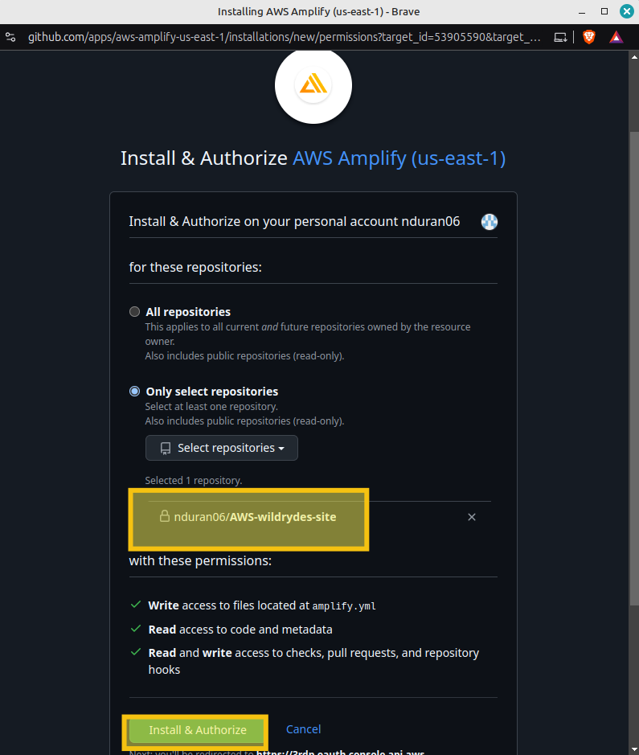
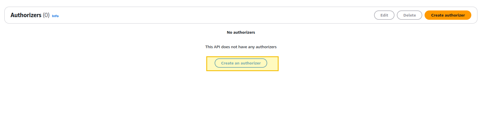
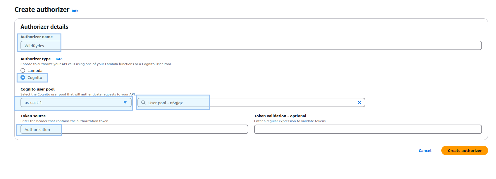

# AYGO-Lab-Information-Security


## Prerequisites

* Have an AWS account
* Have aws-cli and aws-cdk installed locally

**Notes:**

1. This lab used an AWS Academy account; IAM roles are not supported with these account types for performing actions from the CLI.


## AWS-CLI


  
  


## 1. Hosting a static website

1. Create a Github repository (including the README.md); in this case is [AWS-wildrydes-site](https://github.com/nduran06/AWS-wildrydes-site)

2. Launch the [AWS Amplify console](https://console.aws.amazon.com/amplify/home) and click on ***Deploy and app***

  

3. On the Start building with Amplify page, choose ***Github*** as the source code provider

  

4. Update your GitHub permissions

* *Two-factor authentication (2FA) authentication*

  

* The previously created repository is selected for use in AWS Amplify

  
  


5. Select the repository and the branch (*main* in thi case) in AWS Amplify; click on next


6. On the App settings, leave all the default values and click next

7. Your config should look like this:


* Select *Save and Deploy.*


8. When the resource is created, you will see the link to launch the site:


* At this point, if you click on the link provided (in this case *https://main.di8iut3v8urve.amplifyapp.com/*), since it is an empty repository, you should see something like:


9. Go to *App settings* and click on the *Edit* option

  

10. Enable *Branch autodetection* and *Branch auto-disconnection*, then save it:

  

### Populate the git repository

Originally for this workshop, this repository: [aws-samples/
aws-serverless-webapp-workshop](https://github.com/aws-samples/aws-serverless-webapp-workshop) was the one used to populate our repositories; however since it has been archived, a setup mirror was done in this implementation:

1. The previously created repository is cloned locally, and move to it:

```
git clone https://github.com/nduran06/AWS-wildrydes-site.git && cd AWS-wildrydes-site
```
2. Create a bare copy of the *aws-samples/aws-serverless-webapp-workshop* repository (only Git's internal data structures, no source files to edit):

```
git clone --bare https://github.com/aws-samples/aws-serverless-webapp-workshop.git
```

3. Push exact copy (mirror) to the new repository (*AWS-wildrydes-site*)

```
cd aws-serverless-webapp-workshop.git && git push --mirror https://github.com/nduran06/AWS-wildrydes-site.git
```

4. Go up one directory; remove the bare repo directory; update the local repo with remote changes, replaying the local commits on top of the updated remote history:

```
cd .. && rm -rf aws-serverless-webapp-workshop.git && git pull --rebase
```
* This method was used to copy/clone the entire repository, including all branches and history, to the new location while maintaining the full Git history.


* Now, when you click on the link provided (in this case *https://main.di8iut3v8urve.amplifyapp.com/*), you should be able to see the website:

  

## 2. Manage users

  
  
  
  
  
  
  
  
  
  

  


## 3. Serverless service backend

  
  
  
  
  
  
  
  
  
  
  


## 4. Deploy an API RESTful

  
  
  
  
  
  
  
  
  
  
  
  
  
  
  


## Test
  
  
